# Adventureworks-Business-Analysis
---

# Question 1 – How Many Customers Does AdventureWorks Have?

## Business Question

The Sales Manager wants to understand the size of the company's customer base before carrying out further customer and sales analysis.

## Objective

Count the total number of customers stored within the AdventureWorks database.

## Why is this important?

Understanding the number of customers provides a baseline for future analysis. It helps the business measure customer growth, calculate customer-based KPIs and understand the scale of its customer database.

## SQL Skills Demonstrated

- `SELECT`
- `COUNT()`
- Aggregate Functions

## SQL Query

```sql
SELECT COUNT(*) AS TotalCustomers
FROM SalesLT.Customer;
```

## Query Result

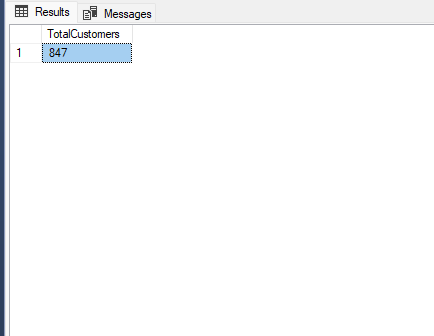

## Business Insight

The query counts every customer stored within the AdventureWorks database, providing a clear view of the size of the company's customer base.

This figure can be used as a starting point for future analysis such as customer segmentation, customer spending and customer retention.

## Recommendation

The business should regularly monitor customer growth over time and compare it against sales performance to better understand whether increases in customers are leading to increased revenue.

## Files

| File | Description |
|------|-------------|
| `01_total_customers.sql` | SQL query used to count the total number of customers |
| `question_01_result.png` | Screenshot of the SQL query and output |

---

# Question 2 – Which Products Have the Highest List Prices?

## Business Question

The Sales Manager wants to identify the company's highest-priced products to better understand the premium end of the product range.

## Objective

Retrieve the top 10 products with the highest list prices from the AdventureWorks database.

## Why is this important?

Understanding which products have the highest selling prices helps the business identify premium products, support pricing strategies and compare high-value products against future sales performance.

It also provides a starting point for analysing whether expensive products generate proportionally higher revenue.

## SQL Skills Demonstrated

- `SELECT`
- `TOP`
- `ORDER BY`
- Column Selection

## SQL Query

```sql
SELECT TOP 10
    ProductID,
    Name,
    ListPrice
FROM SalesLT.Product
ORDER BY ListPrice DESC;
```

## Query Result

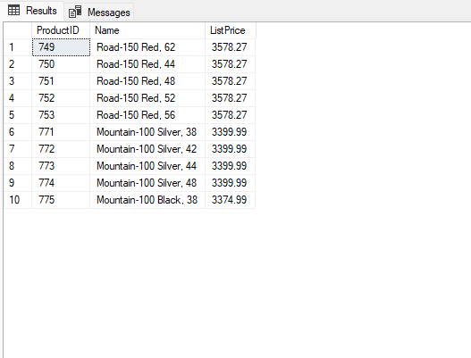

## Business Insight

The query returns the ten products with the highest list prices, ranked from most expensive to least expensive.

This allows management to quickly identify premium products within the catalogue and compare them against future sales and revenue analysis.

## Recommendation

The business should compare these high-priced products with future sales and revenue reports to determine whether premium pricing translates into stronger business performance or whether lower-priced products generate greater overall revenue through higher sales volumes.

## Files

| File | Description |
|------|-------------|
| `02_products_by_price.sql` | SQL query used to identify the top 10 highest-priced products |
| `question_02_result.png` | Screenshot of the SQL query and output |


---

# Question 3 – Which Products Generated the Most Revenue?

## Business Question

The Sales Manager wants to know which products generate the highest revenue so the business can prioritise inventory, marketing, and future sales strategies.

---

## Objective

Identify the **top 10 revenue-generating products** by combining product information with sales data.

---

## Why is this important?

Understanding which products generate the most revenue helps businesses to:

- Prioritise high-performing products
- Improve inventory planning
- Focus marketing on successful products
- Support future business decisions with data

---

## SQL Skills Demonstrated

- INNER JOIN
- SUM()
- GROUP BY
- ORDER BY
- TOP
- Table Aliases
- Aggregate Functions

---

## SQL Query

```sql
SELECT TOP 10
    p.ProductID,
    p.Name AS ProductName,
    SUM(sod.OrderQty) AS TotalQuantitySold,
    CAST(SUM(sod.LineTotal) AS DECIMAL(18,2)) AS TotalRevenue
FROM SalesLT.Product AS p
INNER JOIN SalesLT.SalesOrderDetail AS sod
    ON p.ProductID = sod.ProductID
GROUP BY
    p.ProductID,
    p.Name
ORDER BY
    TotalRevenue DESC;
```

---

## Query Result

*(Insert a screenshot here)*

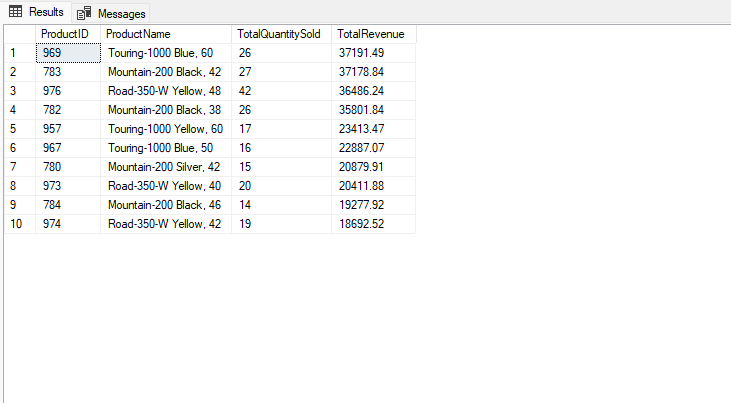

---

## Business Insight

The query identifies the products that generated the highest total revenue across all customer orders.

Rather than looking at individual sales, the data has been grouped by product, allowing management to quickly identify which products contribute the most towards overall company revenue.

This provides a clear picture of the company's highest-performing products from a sales perspective.

---

## Recommendation

The business should continue monitoring the highest revenue-generating products to ensure stock availability and maintain strong sales performance.

However, revenue alone does not indicate profitability. Future analysis should also consider product costs and profit margins before making strategic investment decisions.

---

## Files

| File | Description |
|------|-------------|
| `sql/03_top_products_by_revenue.sql` | SQL query used to answer the business question |
| `images/question_03_result.png` | Screenshot of the SQL query and output |


---

# Question 4 – Which Product Categories Generate the Most Revenue?

## Business Question

The Sales Manager wants to understand which product categories generate the highest revenue so that future investment, inventory planning and marketing campaigns can focus on the strongest-performing areas of the business.

---

## Objective

Calculate the total revenue generated by each product category and rank them from highest to lowest.

---

## Why is this important?

Knowing which product categories generate the highest revenue helps management prioritise business investment, identify high-performing product lines and support strategic decision-making.

---

## SQL Skills Demonstrated

- INNER JOIN
- Multiple Table Joins
- SUM()
- GROUP BY
- ORDER BY
- Aggregate Functions

---

## SQL Query

```sql
SELECT
    pc.Name AS ProductCategory,
    CAST(SUM(sod.LineTotal) AS DECIMAL(18,2)) AS TotalRevenue
FROM SalesLT.ProductCategory AS pc
INNER JOIN SalesLT.Product AS p
    ON pc.ProductCategoryID = p.ProductCategoryID
INNER JOIN SalesLT.SalesOrderDetail AS sod
    ON p.ProductID = sod.ProductID
GROUP BY
    pc.Name
ORDER BY
    TotalRevenue DESC;
```

---

## Query Result

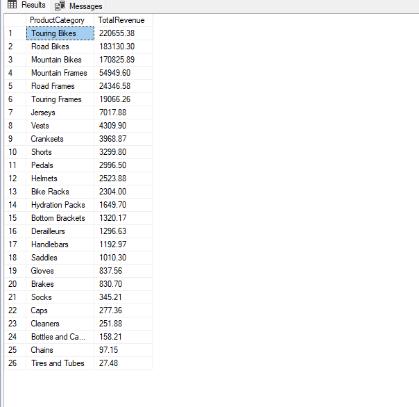

---

## Business Insight

This analysis highlights which product categories contribute the most revenue across all customer orders, helping the business understand where the majority of sales income is generated.

---

## Recommendation

Continue monitoring the highest-performing categories while investigating lower-performing categories to identify opportunities for growth or improvement.

---

## Files

| File | Description |
|------|-------------|
| `04_revenue_by_category.sql` | SQL query used to calculate total revenue by product category |
| `question_04_result.png` | Screenshot of the SQL query and output |


---

# Question 5 – Which Customers Generated the Most Revenue?

## Business Question

The Sales Manager wants to identify the customers who contribute the most revenue so the business can better understand its highest-value customer relationships.

## Objective

Rank the top 10 customers by total order value and show how many orders each customer placed.

## Why is this important?

Identifying high-value customers can support:

- Customer retention
- Account management
- Loyalty initiatives
- Sales prioritisation
- Revenue concentration analysis

## SQL Skills Demonstrated

- `INNER JOIN`
- `COUNT()`
- `COUNT(DISTINCT ...)`
- `SUM()`
- `GROUP BY`
- `ORDER BY`
- `TOP`
- `CONCAT()`
- Table aliases

## SQL Query

```sql
SELECT TOP 10
    c.CustomerID,
    CONCAT(c.FirstName, ' ', c.LastName) AS CustomerName,
    c.CompanyName,
    COUNT(DISTINCT soh.SalesOrderID) AS TotalOrders,
    CAST(SUM(soh.TotalDue) AS DECIMAL(18, 2)) AS TotalRevenue
FROM SalesLT.Customer AS c
INNER JOIN SalesLT.SalesOrderHeader AS soh
    ON c.CustomerID = soh.CustomerID
GROUP BY
    c.CustomerID,
    c.FirstName,
    c.LastName,
    c.CompanyName
ORDER BY
    TotalRevenue DESC;
```

## Query Result

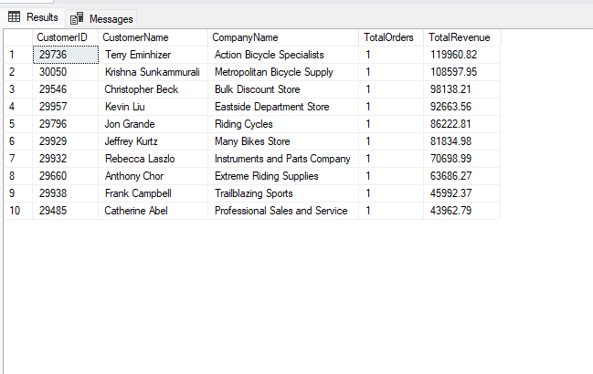

## Business Insight

The query identifies the ten customers who generated the highest total order value. Including the number of orders helps distinguish customers who made one large purchase from customers who generated revenue through repeated orders.

## Recommendation

The business should review its highest-value customers for retention and account-management opportunities. It should also assess whether revenue is overly concentrated among a small number of customers, as losing one major account could create significant business risk.

## Limitation

This query ranks customers using `TotalDue`, which includes tax and freight. A separate analysis using order subtotal would be needed to measure product sales revenue only.

## Files

| File | Description |
|---|---|
| `05_top_customers_by_revenue.sql` | SQL query used to rank customers by total order value |
| `question_05_result.png` | Screenshot of the SQL query and result |

---

# Question 6 – What Was the Overall Sales Performance in June 2008?

## Business Question

The Sales Manager wants a summary of sales performance for the period covered by the AdventureWorksLT database.

## Objective

Calculate the number of orders, total revenue and average order value for June 2008.

## Why is this important?

A high-level sales summary gives management a baseline view of business performance before carrying out more detailed analysis by customer, product or category.

## SQL Skills Demonstrated

- `YEAR()`
- `MONTH()`
- `COUNT()`
- `SUM()`
- `AVG()`
- `GROUP BY`
- `CAST()`

## SQL Query

```sql
SELECT
    YEAR(OrderDate) AS SalesYear,
    MONTH(OrderDate) AS SalesMonth,
    COUNT(SalesOrderID) AS TotalOrders,
    CAST(SUM(TotalDue) AS DECIMAL(18, 2)) AS TotalRevenue,
    CAST(AVG(TotalDue) AS DECIMAL(18, 2)) AS AverageOrderValue
FROM SalesLT.SalesOrderHeader
GROUP BY
    YEAR(OrderDate),
    MONTH(OrderDate);
```

## Query Result

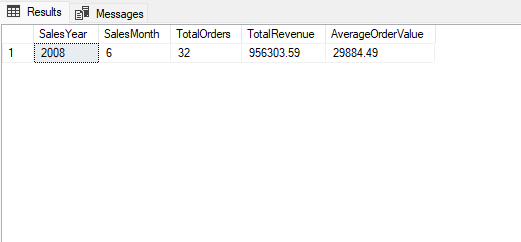

## Business Insight

The database contains 32 orders from June 2008, generating total revenue of £956,303.59. The average order value was approximately £29,884.49.

## Limitation

The AdventureWorksLT dataset contains only one month of order data, so it cannot be used to assess monthly growth, seasonality or long-term sales trends.

## Recommendation

Use this result as a baseline sales summary. A larger dataset covering multiple months or years would be required for meaningful trend and forecasting analysis.

## Files

| File | Description |
|---|---|
| `06_june_2008_sales_summary.sql` | SQL query summarising sales performance for June 2008 |
| `question_06_result.png` | Screenshot of the SQL query and output |

## Question 7: Which Customers Have the Highest Average Order Value?

### Business Question

Which customers spend the most money on average each time they place an order?

### Objective

The objective was to calculate the Average Order Value for each customer and identify the customers who usually place the highest-value orders.

This helps the business compare customers based on their typical order size rather than only their total spending.

### Why This Is Important

A customer may generate high total revenue by placing many smaller orders.

Another customer may place fewer orders but spend much more each time.

Average Order Value helps AdventureWorks identify customers who may be suitable for premium account support, retention campaigns, and upselling opportunities.

### SQL Skills Demonstrated

* `TOP`
* `INNER JOIN`
* `CONCAT`
* `COUNT`
* `SUM`
* `AVG`
* `CAST`
* `GROUP BY`
* `ORDER BY`
* Table aliases

### SQL Query

```sql
SELECT TOP 10
    c.CustomerID,
    CONCAT(c.FirstName, ' ', c.LastName) AS CustomerName,
    COUNT(soh.SalesOrderID) AS TotalOrders,
    CAST(SUM(soh.TotalDue) AS DECIMAL(18,2)) AS TotalRevenue,
    CAST(AVG(soh.TotalDue) AS DECIMAL(18,2)) AS AverageOrderValue
FROM SalesLT.Customer AS c
INNER JOIN SalesLT.SalesOrderHeader AS soh
    ON c.CustomerID = soh.CustomerID
GROUP BY
    c.CustomerID,
    c.FirstName,
    c.LastName
ORDER BY
    AverageOrderValue DESC;
```

### Query Result

The query returned the 10 customers with the highest Average Order Value.

The customer with the highest Average Order Value was **[Customer Name]**, with an average order value of **£[Amount]** across **[Number of Orders] order/orders**.

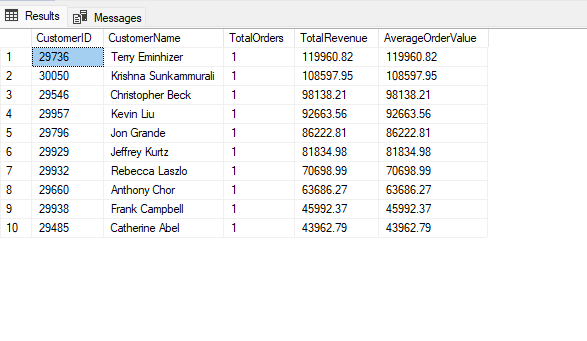

### Business Insight

The results show which customers spend the most per order on average.

However, some customers may have a high Average Order Value because they placed only one large order. Customers with both a high Average Order Value and multiple orders may represent more reliable high-value customers.

The number of orders and total revenue should therefore be considered alongside Average Order Value.

### Recommendation

AdventureWorks should prioritise customers who have both a high Average Order Value and multiple completed orders.

These customers may offer stronger opportunities for retention, premium account management, and upselling.

Customers with a high Average Order Value from only one order should be monitored separately until more purchasing history is available.

### Limitations

The analysis uses `TotalDue`, which includes tax and freight.

This means the result represents the full amount charged to the customer rather than product revenue alone.

The dataset also contains only one month of sales data, so long-term customer behaviour cannot be measured.

### Files

| File                                     | Description                                             |
| ---------------------------------------- | ------------------------------------------------------- |
| `07_average_order_value_by_customer.sql` | Calculates Average Order Value for the top 10 customers |
| `question_07_result.png`                 | Screenshot of the query results                         |


## Question 8: Which Orders Were Worth More Than the Average Order?

### Business Question

Which sales orders had a total value greater than the average order value across the business?

### Objective

The objective was to identify unusually high-value orders by comparing each order against the overall average order value.

This helps AdventureWorks focus on larger purchases and investigate which customers and sales activity contributed to stronger-than-average orders.

### Why This Is Important

Orders above the average value may represent important customers, successful sales opportunities, or purchasing patterns that the business could try to repeat.

Identifying these orders can help the Sales Manager understand what drives larger purchases and support future upselling and customer-retention strategies.

### SQL Skills Demonstrated

* Subqueries
* `WHERE`
* Comparison operator `>`
* `AVG`
* `CAST`
* `ORDER BY`

### SQL Query

```sql
SELECT
    soh.SalesOrderID,
    soh.OrderDate,
    soh.CustomerID,
    CAST(soh.TotalDue AS DECIMAL(18,2)) AS OrderValue
FROM SalesLT.SalesOrderHeader AS soh
WHERE soh.TotalDue > (
    SELECT AVG(TotalDue)
    FROM SalesLT.SalesOrderHeader
)
ORDER BY
    OrderValue DESC;
```

### Query Result

The query returned all sales orders with a total value greater than the overall average order value.

The highest-value order was **Sales Order [Order ID]**, with a total value of **£[Order Value]**.

The query returned **[Number of Orders] orders** that were above the business average.

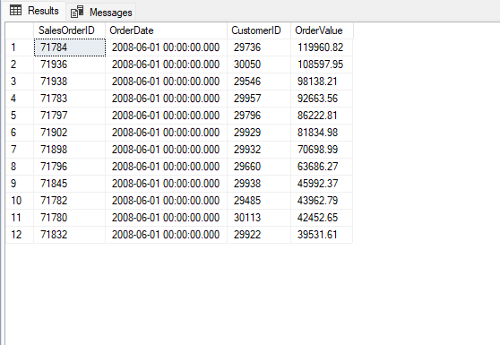

### Business Insight

The results show that a smaller group of orders generated values above the overall business average.

The highest-ranked orders were significantly larger than a typical order, suggesting that certain customers or purchases contributed a disproportionate amount of revenue.

These high-value orders should be investigated further to understand which products, customers, or purchasing behaviours drove their value.

### Recommendation

AdventureWorks should review the customers and products connected to these above-average orders.

The business should identify whether these larger purchases were driven by bulk buying, particular product categories, repeat customers, or one-off transactions.

If common patterns are found, AdventureWorks could use them to improve upselling campaigns, customer account management, and product promotions.

### Limitations

The analysis uses `TotalDue`, which includes tax and freight as well as the product subtotal.

The query only identifies whether an order was above average. It does not explain why the order was valuable or whether it was profitable.

Additional analysis would be needed to examine the products, quantities, customers, and profit margins connected to each order.

### Files

| File                                | Description                                                 |
| ----------------------------------- | ----------------------------------------------------------- |
| `08_orders_above_average_value.sql` | Identifies orders worth more than the overall average order |
| `question_08_result.png`            | Screenshot of the query results                             |
## Question 9: How Do Products Rank Within Their Own Categories by Revenue?

### Business Question

How do products rank within their own product categories based on the revenue they generated?

### Objective

The objective was to calculate the total revenue generated by each product and rank products against other products in the same category.

This provides a fairer comparison than ranking every product across the entire business because products within the same category are more likely to have similar uses, prices, and customer demand.

### Why This Is Important

AdventureWorks needs to understand which products lead each category and which products perform less strongly compared with similar products.

This can help the business make better decisions about stock levels, product promotions, category investment, and underperforming products.

### SQL Skills Demonstrated

* Window functions
* `RANK()`
* `OVER`
* `PARTITION BY`
* Multiple joins
* Aggregate calculations

### SQL Query

```sql
SELECT
    pc.Name AS CategoryName,
    p.Name AS ProductName,
    CAST(SUM(sod.LineTotal) AS DECIMAL(18,2)) AS ProductRevenue,
    RANK() OVER (
        PARTITION BY pc.Name
        ORDER BY SUM(sod.LineTotal) DESC
    ) AS RevenueRank
FROM SalesLT.ProductCategory AS pc
INNER JOIN SalesLT.Product AS p
    ON pc.ProductCategoryID = p.ProductCategoryID
INNER JOIN SalesLT.SalesOrderDetail AS sod
    ON p.ProductID = sod.ProductID
GROUP BY
    pc.Name,
    p.Name
ORDER BY
    pc.Name,
    RevenueRank;
```

### Query Result

The query ranked each product according to the revenue it generated within its own category.

Each category restarted at rank 1, allowing the highest-performing product in every category to be identified.

The highest-revenue product in **[Category Name]** was **[Product Name]**, generating **£[Revenue]**.

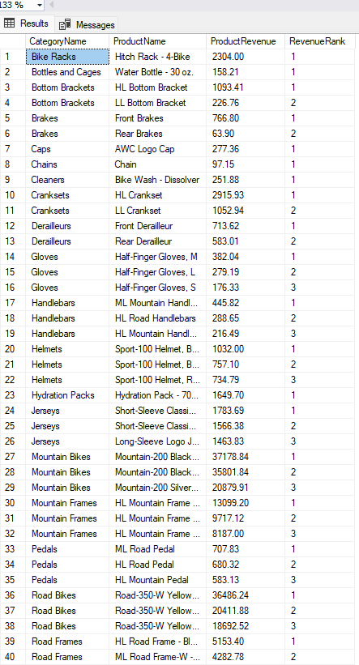
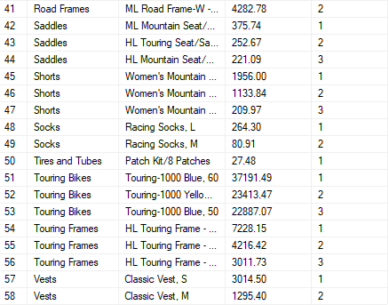

### Business Insight

The results show which products are the strongest revenue generators within each product category.

Some categories may depend heavily on one leading product, while others may have revenue distributed more evenly across several products.

This helps AdventureWorks distinguish category leaders from lower-performing products without comparing unrelated products across the entire catalogue.

### Recommendation

AdventureWorks should protect stock availability and marketing support for the highest-ranked products in each category.

Lower-ranked products should be reviewed to determine whether they need stronger promotion, pricing changes, product improvements, or reduced stock investment.

The business should also investigate categories that rely heavily on one product because this may create a concentration risk if demand for that product declines.

### Limitations

The analysis ranks products using revenue rather than profit.

A high-revenue product may also have high manufacturing, purchasing, or delivery costs.

The dataset contains only one month of sales data, so the rankings may not represent long-term product performance or seasonal demand.

### Files

| File                                      | Description                                           |
| ----------------------------------------- | ----------------------------------------------------- |
| `09_product_revenue_rank_by_category.sql` | Ranks products by revenue within their own categories |
| `question_09_result.png`                  | Screenshot of the product ranking results             |

### Addintional Note

The query returned the top three revenue-generating products within each product category. By ranking products inside each category and filtering to the top three, the report highlights the strongest-performing products while keeping the results concise and easy to interpret.

## Question 10: Which Products Have Never Been Ordered?

### Business Question

Which products exist in the AdventureWorks catalogue but have never appeared in a customer order?

### Objective

The objective was to identify products with no recorded sales activity.

This helps the business find catalogue items that may require further investigation because they have not generated any orders.

### Why This Is Important

Products that have never been ordered may be using warehouse space, receiving catalogue exposure, or creating purchasing costs without generating revenue.

Identifying these products allows AdventureWorks to investigate whether they are poorly promoted, incorrectly priced, unavailable, outdated, or no longer relevant to customers.

### SQL Skills Demonstrated

* `LEFT JOIN`
* `NULL`
* `IS NULL`
* Identifying unmatched records
* Multiple table joins

### SQL Query

```sql
SELECT
    p.ProductID,
    p.Name AS ProductName,
    pc.Name AS CategoryName,
    CAST(p.ListPrice AS DECIMAL(18,2)) AS ListPrice
FROM SalesLT.Product AS p
LEFT JOIN SalesLT.SalesOrderDetail AS sod
    ON p.ProductID = sod.ProductID
LEFT JOIN SalesLT.ProductCategory AS pc
    ON p.ProductCategoryID = pc.ProductCategoryID
WHERE sod.ProductID IS NULL
ORDER BY
    pc.Name,
    p.Name;
```

### Query Result

The query returned **[Number of Products] products** that had not appeared in any recorded sales order.

The results included the product name, category, and list price to give the business additional context when reviewing unsold items.

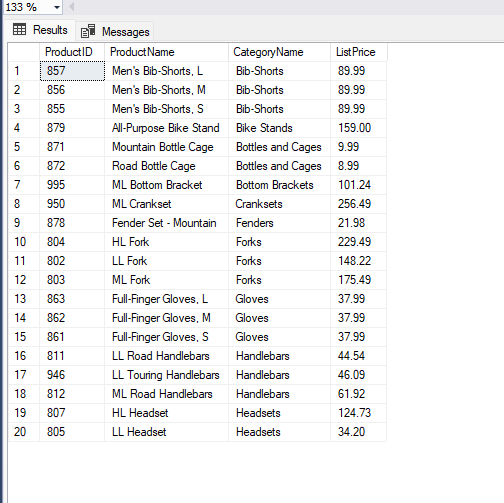

### Business Insight

The analysis identified products that were available in the product catalogue but had no matching sales records.

These products may represent weak customer demand, catalogue issues, poor visibility, unsuitable pricing, or products that were unavailable during the period covered by the data.

The result does not automatically prove that these products are poor performers. It only shows that they were not present in the available order data.

### Recommendation

AdventureWorks should review the products with no recorded orders and investigate their pricing, stock availability, catalogue visibility, and customer demand.

Products that are available but receive no sales may need stronger promotion or pricing changes.

Products that are outdated, unavailable, or no longer commercially useful should be considered for removal from the active catalogue.

### Limitations

The dataset contains only one month of sales data.

A product that did not sell during this period may still perform well across a longer timeframe.

The analysis also does not confirm whether each product was actively stocked, available for sale, or newly added to the catalogue.

### Files

| File                            | Description                                                  |
| ------------------------------- | ------------------------------------------------------------ |
| `10_products_never_ordered.sql` | Identifies catalogue products with no matching sales records |
| `question_10_result.png`        | Screenshot of the products with no recorded orders           |


## Question 11: What Percentage of Total Revenue Does Each Product Category Generate?

### Business Question

What percentage of total sales revenue is generated by each product category?

### Objective

The objective was to calculate the revenue generated by each product category and measure its percentage contribution to overall revenue.

This helps AdventureWorks understand which categories contribute most strongly to business performance.

### Why This Is Important

A category may generate a large amount of revenue but its importance is clearer when compared with total business revenue.

This analysis helps management identify dominant categories, weaker categories, and potential revenue concentration risks.

### SQL Skills Demonstrated

* Percentage calculations
* Window aggregation
* `OVER`
* Nested aggregate functions

### SQL Query

```sql
SELECT
    pc.Name AS CategoryName,
    CAST(SUM(sod.LineTotal) AS DECIMAL(18,2)) AS CategoryRevenue,
    CAST(
        SUM(sod.LineTotal) * 100.0
        / SUM(SUM(sod.LineTotal)) OVER ()
        AS DECIMAL(5,2)
    ) AS RevenuePercentage
FROM SalesLT.ProductCategory AS pc
INNER JOIN SalesLT.Product AS p
    ON pc.ProductCategoryID = p.ProductCategoryID
INNER JOIN SalesLT.SalesOrderDetail AS sod
    ON p.ProductID = sod.ProductID
GROUP BY
    pc.Name
ORDER BY
    RevenuePercentage DESC;
```

### Query Result

The query calculated the total revenue generated by each product category and its percentage contribution to overall revenue.

The largest category was **[Category Name]**, which generated **£[Revenue]** and represented **[Percentage]%** of total revenue.

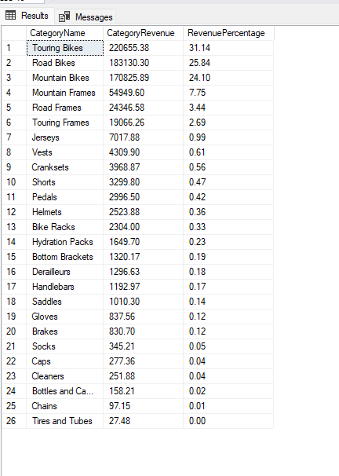

### Business Insight

The analysis shows whether AdventureWorks revenue is spread evenly across categories or concentrated in a small number of product areas.

A category with a particularly large percentage contribution may be a major source of business strength, but it may also create risk if the company becomes too dependent on it.

### Recommendation

AdventureWorks should continue supporting its strongest revenue-generating categories while reviewing lower-contributing categories for growth opportunities.

Management should also monitor revenue concentration and avoid becoming overly dependent on one category.

### Limitations

The analysis measures revenue rather than profit.

A category with a high revenue percentage may also have high product, manufacturing, or delivery costs.

The dataset covers only one month, so the percentages may not reflect long-term performance.

### Files

| File                                 | Description                                             |
| ------------------------------------ | ------------------------------------------------------- |
| `11_category_revenue_percentage.sql` | Calculates category revenue and percentage contribution |
| `question_11_result.png`             | Screenshot of the category revenue percentage results   |


## Question 12: How Can Customers Be Grouped by Total Spending?

### Business Question

How can AdventureWorks group customers into high-, medium-, and lower-value segments based on their total spending?

### Objective

The objective was to calculate each customer's total spending and assign them to a customer-value segment.

This allows the business to compare customers using clear spending categories rather than reviewing individual revenue figures alone.

### Why This Is Important

Different customers may require different sales and marketing approaches.

High-value customers may benefit from stronger retention activity and dedicated account support, while medium- and lower-value customers may present opportunities for targeted promotions and upselling.

Customer segmentation helps AdventureWorks use its resources more effectively.

### SQL Skills Demonstrated

* `CASE`
* Conditional logic
* Customer segmentation
* CTEs
* Multiple conditions

### SQL Query

```sql
WITH CustomerSpending AS
(
    SELECT
        c.CustomerID,
        CONCAT(c.FirstName, ' ', c.LastName) AS CustomerName,
        COUNT(soh.SalesOrderID) AS TotalOrders,
        CAST(SUM(soh.TotalDue) AS DECIMAL(18,2)) AS TotalSpent
    FROM SalesLT.Customer AS c
    INNER JOIN SalesLT.SalesOrderHeader AS soh
        ON c.CustomerID = soh.CustomerID
    GROUP BY
        c.CustomerID,
        c.FirstName,
        c.LastName
)

SELECT
    CustomerID,
    CustomerName,
    TotalOrders,
    TotalSpent,
    CASE
        WHEN TotalSpent >= 100000 THEN 'High Value'
        WHEN TotalSpent >= 50000 THEN 'Medium Value'
        ELSE 'Lower Value'
    END AS CustomerSegment
FROM CustomerSpending
ORDER BY
    TotalSpent DESC;
```

### Query Result

The query grouped customers into three spending segments:

* High Value: customers who spent £100,000 or more.
* Medium Value: customers who spent between £50,000 and £99,999.99.
* Lower Value: customers who spent below £50,000.

The highest-spending customer was **[Customer Name]**, who spent **£[Total Spent]** and was classified as **[Customer Segment]**.

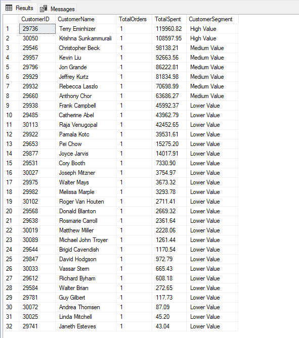

### Business Insight

The segmentation shows how customer revenue is distributed across different spending levels.

AdventureWorks can use this information to identify its most financially valuable customers and distinguish them from customers with lower total spending.

The results may also show whether the business depends heavily on a small group of high-value customers.

### Recommendation

AdventureWorks should prioritise retention and account management for high-value customers.

Medium-value customers should be considered for targeted upselling campaigns, while lower-value customers may benefit from broader promotional activity designed to increase order frequency or order size.

The spending thresholds should be reviewed using a larger dataset before being adopted as permanent business rules.

### Limitations

The spending segments are based on manually selected thresholds.

Different thresholds may produce different customer groups.

The analysis also uses `TotalDue`, which includes tax and freight, and the dataset contains only one month of sales data.

### Files

| File                                | Description                                         |
| ----------------------------------- | --------------------------------------------------- |
| `12_customer_spending_segments.sql` | Groups customers into spending-based value segments |
| `question_12_result.png`            | Screenshot of the customer segmentation results     |
